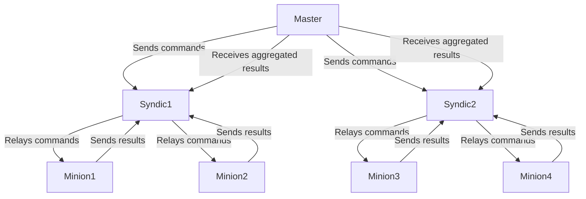
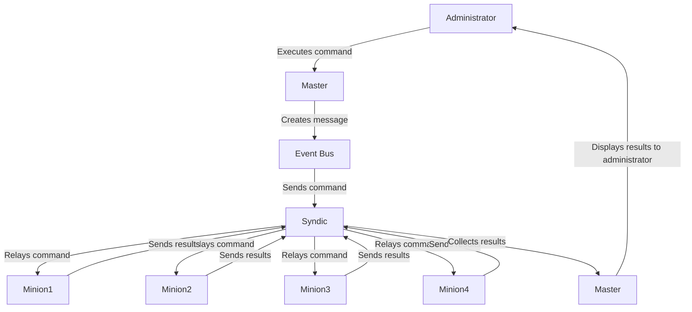
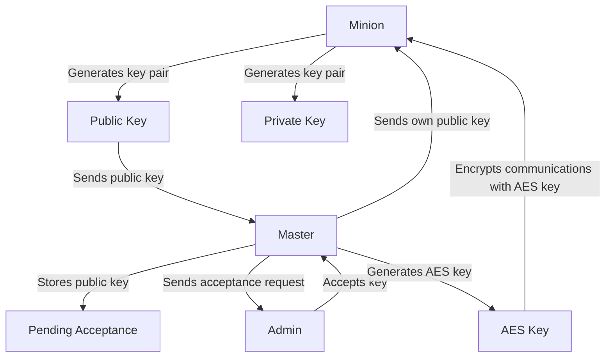

# Salt Architecture with 1 Master, 2 Syndics, and Minions

## Overview

This architecture consists of:
- 1 Master
- 2 Syndics (Syndic1 and Syndic2)
- Several Minions connected to the Syndics in a distributed mode

## Roles of Components

### Master
- **Role**: The master is the core of the Salt infrastructure. It manages all minions and syndics, sending commands and receiving results. This is also where global configurations are defined.
- **Functions**:
  - Sending commands to the syndics.
  - Receiving aggregated results from the syndics.
  - Managing keys and authorizations.

### Syndics
- **Role**: Syndics act as intermediaries between the master and the minions. They delegate the management of local minions while maintaining communication with the master.
- **Functions**:
  - Transmitting commands from the master to local minions.
  - Collecting and aggregating results from minions to send back to the master.
  - Optionally executing a local master to manage minions in case of loss of connection with the main master.

### Minions
- **Role**: Minions are agents that execute commands sent by the master or syndics. They are installed on each machine you want to manage.
- **Functions**:
  - Executing commands received from the syndic or master.
  - Reporting execution results back to the syndic or master.
  - Sending information about the status of the machine they are attached to.

## ZeroMQ

ZeroMQ (or ØMQ) is an asynchronous messaging library designed for use in distributed or concurrent applications. Unlike message-oriented middleware, ZeroMQ operates without a dedicated broker, allowing for direct communication between components. Here are some key features:

- **Sockets**: ZeroMQ uses sockets that allow for N-to-N connections between endpoints. Each socket can be configured for different communication patterns.
- **Communication Patterns**: The main patterns include:
  - **Request-Reply**: A classic model where a client sends a request and waits for a response.
  - **Publish-Subscribe**: Allows a publisher to broadcast messages to multiple subscribers.
  - **Push-Pull**: Used for distributing tasks among multiple workers.

ZeroMQ is particularly optimized for scalability and performance, making it an ideal choice for systems requiring fast and efficient communication.

## Communication Flow

1. **Minion -> Master (ports 4505/4506)**:
   - Initial connection and key exchange.
   - Listening for commands on port 4505.
   - Sending execution results on port 4506.

2. **Master -> Syndic (ports 4505/4506)**:
   - Sending commands to be executed on minions via port 4505.
   - This flow uses the Publish-Subscribe model, where the master publishes the command on the event bus, allowing syndics to listen for and receive these messages.
   - Receiving aggregated results from minions via port 4506.

3. **Syndic -> Local Minions (ports 4505/4506)**:
   - Transmitting commands from the main master via port 4505.
   - The syndic acts as a publisher, relaying the command received to its local minions that have subscribed to this type of event via their ZeroMQ socket configured in "SUB" mode.
   - **Minions actively listen for messages published by their syndic on ZeroMQ**, allowing them to execute the command as soon as it is received without delay.
   - Receiving execution results via port 4506.

4. **Minions -> Syndic (ports 4505/4506)**:
   - Actively listening for commands on port 4505 via their socket configured in "SUB" mode.
   - Sending execution results back to the syndic on port 4506.

## Workflow for Sending Commands

This diagram provides a visual representation of how commands flow from the administrator through the master and syndics to the minions, and how results are returned.

Explanation of the Diagram
- **Administrator**: The user who initiates the process by executing a command.
- **Master**: The core component that creates a message containing the command and sends it to the event bus.
- **Event Bus**: The medium through which commands are sent to the syndics.
- **Syndic**: Receives the command from the master and relays it to its local minions.
- **Minions**: Execute the received commands and send their results back to the syndic.
- **Results Collection**: The syndic collects the results from all its minions and sends them back to the master.
- **Display Results**: Finally, the master displays the aggregated results to the administrator.

1. **Sending the Command**:
   - The administrator executes a command from the master, e.g., `salt '*' test.ping`.
   - The master creates a message containing this command and sends it to the event bus via ZeroMQ on port 4505.

2. **Transmission by the Syndic**:
   - The syndic listens for published messages on this port. When it receives the command, it relays it to its local minions using ZeroMQ on port 4505.

3. **Execution by Minions**:
   - Each minion examines the received command, evaluates whether it should be executed based on its configuration, and executes the task if necessary.
   - Minions send their results back to the syndic via port 4506.

4. **Return to the Syndic**:
   - The syndic collects results from its minions and sends them back to the main master on port 4506.

5. **Return to Master**:
   - The master receives all aggregated results from the syndic and displays them to the administrator.

## Design Patterns for Sending Commands

Salt uses various design patterns for sending commands, including:

### Request-Reply Model
This model is used when the master sends a specific command to one or more minions and waits for an immediate response. It is a synchronous model where each request must receive a response before other requests can be sent.

### Publish-Subscribe Model
In this model, the master publishes events or tasks, and syndics subscribe to these events. This allows syndics (and potentially minions) to actively listen for updates or notifications without needing to constantly poll the master. It is particularly useful for:
- Broadcasting real-time information.
- Managing events where multiple minions need to react simultaneously to a change in infrastructure.

### Subscription System
The subscription system allows syndics and minions to sign up for different types of events or messages published by the master or other components of the system. This facilitates setting up a reactive architecture where agents can act immediately when a relevant event occurs without requiring an explicit request from the master.

## Salt Key Exchange Mechanism

Salt uses a public key cryptography system for authentication and encryption of communications. Here’s how the key exchange mechanism works:

1. **Key Generation**:
   - Each minion generates an RSA key pair (public and private) at startup.
   - The Salt master also has its own RSA key pair.

2. **Initial Exchange**:
   - Upon first connection, the minion sends its public key to the master.
   - This key is stored on the master pending acceptance.

3. **Key Acceptance**:
   - The administrator of the master must explicitly accept the minion's key (via `salt-key -A`).
   - This step verifies each minion's identity before allowing them to communicate.

4. **Secure Exchange**:
   - Once accepted, the master sends its public key back to the minion.
   - The master also generates a rotating AES key for symmetric encryption of future communications.

5. **Encrypted Communications**:
   - Messages between the master and minion are encrypted using AES keys.
   - The AES key is regularly renewed to enhance security.

### Benefits of this System:
- Mutual authentication between master and minions.
- End-to-end encrypted communications.
- Ability to revoke access from a minion by deleting its key on the master.
- Flexibility in adding or removing minions securely.

This mechanism ensures that only authorized minions can receive and execute commands from the master while guaranteeing confidentiality of exchanged data.