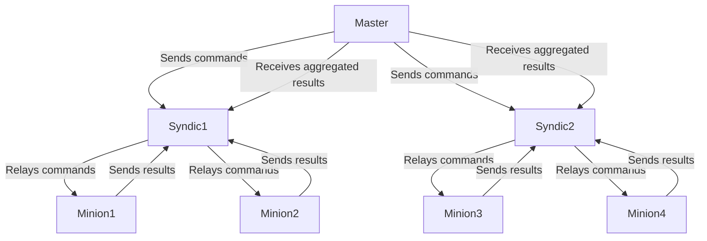
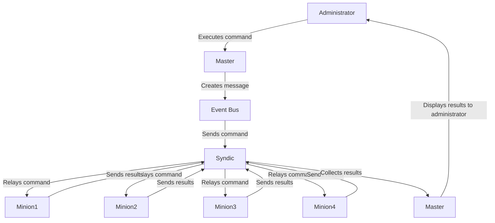
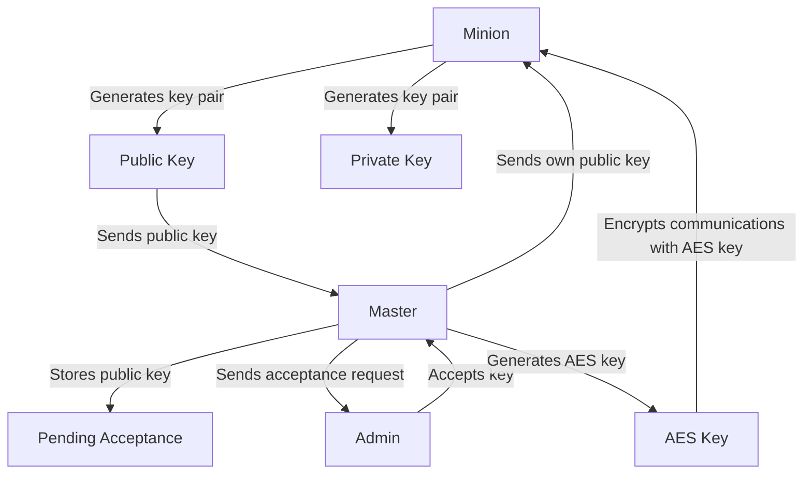

# Architecture Salt avec 1 Master, 2 Syndics et Minions

## Vue d'ensemble

Cette architecture se compose de :
- 1 Master principal
- 2 Syndics (Syndic1 et Syndic2)
- Plusieurs Minions connectés aux Syndics en mode distribué

## Rôles des Composants

### Master Principal
- **Rôle** : Le master principal est le cœur de l'infrastructure Salt. Il gère l'ensemble des minions et syndics, en envoyant des commandes et en recevant des résultats. C'est également ici que les configurations globales sont définies.
- **Fonctions** :
  - Envoi de commandes aux syndics.
  - Réception des résultats agrégés des syndics.
  - Gestion des clés et des autorisations.

### Syndics
- **Rôle** : Les syndics agissent comme intermédiaires entre le master principal et les minions. Ils permettent de déléguer la gestion des minions locaux tout en maintenant une communication avec le master principal.
- **Fonctions** :
  - Transmission des commandes du master principal aux minions locaux.
  - Collecte et agrégation des résultats des minions pour les renvoyer au master principal.
  - Possibilité d'exécuter un master local pour gérer les minions en cas de perte de connexion avec le master principal.

### Minions
- **Rôle** : Les minions sont les agents qui exécutent les commandes envoyées par le master ou les syndics. Ils sont installés sur chaque machine que vous souhaitez gérer.
- **Fonctions** :
  - Exécution des commandes reçues du syndic ou du master.
  - Rapport des résultats d'exécution au syndic ou au master.
  - Envoi d'informations sur l'état de la machine à laquelle ils sont attachés.

## ZeroMQ

ZeroMQ (ou ØMQ) est une bibliothèque de messagerie asynchrone conçue pour être utilisée dans des applications distribuées ou concurrentes. Contrairement aux middleware orientés message, ZeroMQ fonctionne sans courtier dédié, ce qui signifie qu'il offre une communication directe entre les composants. Voici quelques caractéristiques clés :

- **Sockets** : ZeroMQ utilise des sockets qui permettent de créer des connexions N-à-N entre les points d'extrémité. Chaque socket peut être configuré pour différents modèles de communication.
- **Modèles de communication** : Les principaux modèles incluent :
  - **Request-Reply** : Un modèle classique où un client envoie une requête et attend une réponse.
  - **Publish-Subscribe** : Permet à un émetteur (publisher) de diffuser des messages à plusieurs abonnés (subscribers).
  - **Push-Pull** : Utilisé pour distribuer des tâches entre plusieurs travailleurs.

ZeroMQ est particulièrement optimisé pour la scalabilité et la performance, ce qui en fait un choix idéal pour des systèmes nécessitant une communication rapide et efficace.

## Flux de communication

1. **Minion -> Master Principal (ports 4505/4506)**: 
   - Connexion initiale et échange de clés.
   - Écoute des commandes sur le port 4505.
   - Envoi des résultats d'exécution sur le port 4506.

2. **Master Principal -> Syndic (ports 4505/4506)**:
   - Envoi des commandes à exécuter sur les minions via le port 4505. 
   - Ce flux utilise le modèle Publish-Subscribe, où le master publie la commande sur le bus d'événements, permettant aux syndics d'écouter et de recevoir ces messages.
   - Réception des résultats agrégés des minions via le port 4506.

3. **Syndic -> Minions locaux (ports 4505/4506)**:
   - Transmission des commandes du master principal via le port 4505. 
   - Le syndic agit ici comme un publisher, relayant la commande reçue à ses minions locaux qui se sont abonnés à ce type d'événement via leur socket ZeroMQ configurée en mode "SUB".
   - **Les minions écoutent activement les messages publiés par leur syndic sur ZeroMQ**, ce qui leur permet d'exécuter la commande dès qu'elle est reçue sans délai.
   - Réception des résultats d'exécution via le port 4506.

4. **Minions -> Syndic (ports 4505/4506)**:
   - Écoute active des commandes sur le port 4505 via leur socket configurée en mode "SUB".
   - Envoi des résultats d'exécution au syndic sur le port 4506.

## Workflow lors de l'envoi de commandes

Ce diagramme fournit une représentation visuelle de la façon dont les commandes circulent de l'administrateur à travers le master et les syndics vers les minions, et comment les résultats sont retournés.

Explication du Diagramme
- **Administrateur** : L'utilisateur qui initie le processus en exécutant une commande.
- **Master** : Le composant central qui crée un message contenant la commande et l'envoie au bus d'événements.
- **Bus d'Événements** : Le moyen par lequel les commandes sont envoyées aux syndics.
- **Syndic** : Reçoit la commande du master et la relaie à ses minions locaux.
- **Minions** : Exécutent les commandes reçues et renvoient leurs résultats au syndic.
- **Collecte des Résultats** : Le syndic collecte les résultats de tous ses minions et les renvoie au master.
- **Affichage des Résultats** : Enfin, le master affiche les résultats agrégés à l'administrateur.

1. **Envoi de la commande**:
   - L'administrateur exécute une commande depuis le master, par exemple `salt '*' test.ping`.
   - Le master crée un message contenant cette commande et l'envoie au bus d'événements via ZeroMQ sur le port 4505.

2. **Transmission par le syndic**:
   - Le syndic écoute les messages publiés sur ce port. Lorsqu'il reçoit la commande, il la relaye à ses minions locaux en utilisant également ZeroMQ sur le port 4505.

3. **Exécution par les minions**:
   - Chaque minion examine la commande reçue, évalue si elle doit être exécutée en fonction de sa configuration et exécute la tâche si nécessaire.
   - Les minions renvoient leurs résultats au syndic via le port 4506.

4. **Retour au syndic**:
   - Le syndic collecte les résultats provenant de ses minions et les renvoie au master principal sur le port 4506.

5. **Retour au master**:
   - Le master reçoit tous les résultats agrégés du syndic et affiche les résultats à l'administrateur.

## Design Patterns d'envoi de commandes

Salt utilise différents design patterns pour l'envoi de commandes, notamment :

### Modèle Request-Reply
Ce modèle est utilisé lorsque le master envoie une commande spécifique à un ou plusieurs minions et attend une réponse immédiate. C'est un modèle synchrone où chaque requête doit recevoir une réponse avant que d'autres requêtes puissent être envoyées.

### Modèle Publish-Subscribe
Dans ce modèle, le master publie des événements ou des tâches, et les syndics s'abonnent à ces événements. Cela permet aux syndics (et potentiellement aux minions) d'écouter activement les mises à jour ou notifications sans avoir besoin d'interroger constamment le master. C'est particulièrement utile pour :
- La diffusion d'informations en temps réel.
- La gestion d'événements où plusieurs minions doivent réagir simultanément à un changement dans l'infrastructure.

### Système d'abonnement
Le système d'abonnement permet aux syndics et aux minions de s'inscrire à différents types d'événements ou messages publiés par le master ou par d'autres composants du système. Cela facilite la mise en place d'une architecture réactive où les agents peuvent agir immédiatement lorsqu'un événement pertinent se produit, sans nécessiter une demande explicite du master.

## Mécanisme d'échange de clés Salt

Salt utilise un système de cryptographie à clé publique pour l'authentification et le chiffrement des communications. Voici comment fonctionne le mécanisme d'échange de clés :

1. **Génération des clés**:
   - Chaque minion génère une paire de clés RSA (publique et privée) au démarrage.
   - Le master Salt possède également sa propre paire de clés RSA.

2. **Échange initial**:
   - Lors de la première connexion, le minion envoie sa clé publique au master.
   - Cette clé est stockée sur le master en attente d'acceptation.

3. **Acceptation des clés**:
   - L'administrateur du master doit accepter explicitement la clé du minion (via la commande `salt-key -A`).
   - Cette étape permet de vérifier l'identité des minions avant de les autoriser à communiquer.

4. **Échange sécurisé**:
   - Une fois la clé acceptée, le master envoie sa clé publique au minion.
   - Le master génère également une clé AES rotative pour le chiffrement symétrique des communications futures.

5. **Communications chiffrées**:
   - Les messages entre le master et le minion sont chiffrés à l'aide de la clé AES.
   - La clé AES est régulièrement renouvelée pour renforcer la sécurité.

### Intérêt de ce système :
- Authentification mutuelle entre le master et les minions.
- Communications chiffrées de bout en bout.
- Possibilité de révoquer l'accès d'un minion en supprimant sa clé sur le master.
- Flexibilité pour ajouter ou supprimer des minions de manière sécurisée.

Ce mécanisme assure que seuls les minions autorisés peuvent recevoir et exécuter des commandes du master, tout en garantissant la confidentialité des données échangées.